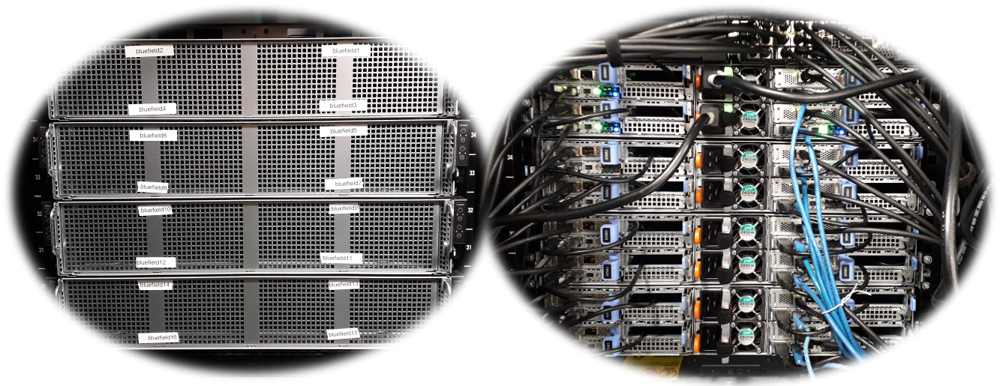

# HPC Hardware Lab @Durham


```{toctree}
:hidden:
access
contribute
historic
cpu
gpu
dine
```

The HPC Hardware Lab @Durham provides Durham and UK researchers with access to cutting edge technologies and facilities.
It is hosted within, yet independent of the [COSMA HPC facility](https://cosma.readthedocs.io) and receives funding from Durham University, industry partners, UKRI (e.g. through ExCALIBUR) and DiRAC. 



These include:

- [DINE:](https://cosma.readthedocs.io/en/latest/dine.html) A test cluster with BlueField-2 DPUs
- [DINE2:](https://cosma.readthedocs.io/en/latest/dine.html#dine2) A test cluster with a composable fabric and NVIDIA Ampere GPUs
- [GPU compute](https://cosma.readthedocs.io/en/latest/hardwarelab.html#gpu-compute)
  - NVIDIA A100, A30, H100
  - NVIDIA Grace Hopper
  - AMD MI100, MI210, MI300X
  - Intel Ponte Vecchio
- [Composable infrastructure](https://cosma.readthedocs.io/en/latest/composable.html)
- [Rockport 6D Torus fabric](https://cosma.readthedocs.io/en/latest/rockportlab.html)
- [Storage laboratory](https://cosma.readthedocs.io/en/latest/storagelab.html)
- [Solar panel installation](https://cosma.readthedocs.io/en/latest/environmental.html#solar-panels)
- [Immersion cooling](https://cosma.readthedocs.io/en/latest/immersion.html)
- [Underground heat storage](https://durham.readthedocs.io/en/latest/ichs/index.html)


Information about how to [access the HPC Hardward Lab](access.md) and associated testbed installations is described [on a dedicated access page](access.md). We appreciate the help of colleagues to keep these pages up-to-date and consistent, and to add any missing information. Please follow the process described on the [contribution](contribute.md) pages.

## Further information

A lot of information about the Durham HPC Hardware Lab is hosted by the [COSMA HPC documentation](https://cosma.readthedocs.io/en/latest/hardwarelab.html).


A list of [historical hardware](historic.md) (now retired) is maintained.
