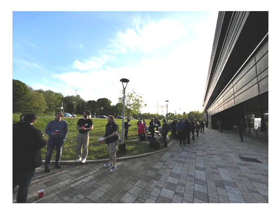
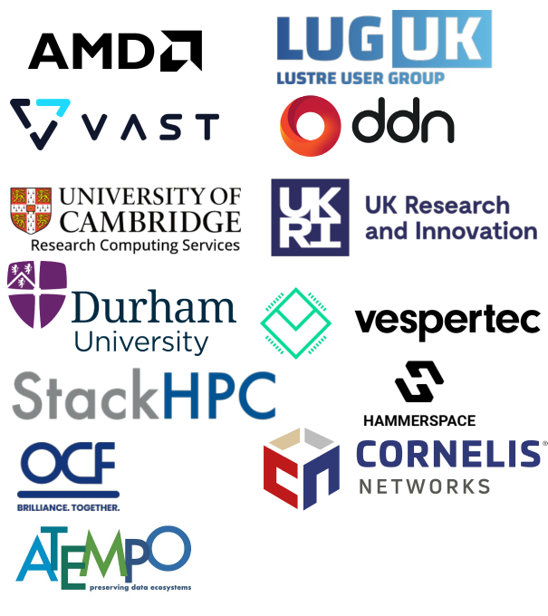

# Durham HPC Days 2025
**2nd - 7th June 2025**\
**Durham University, Department of Computer Science, Durham, UK**

Consult the [HPC Days 2025 landing page](https://www.durham.ac.uk/research/institutes-and-centres/data-science/events-/durham---hpc-days/) for related information on the registration, the submission of presentations, sponsors, and further travel advice.

```{toctree}
:hidden:
talks
tutorials
keynotes
workshops
contribute
social
```



## Registration 
Please register to join us at the Durham HPC Days 2025 [here](https://pay.durham.ac.uk/event-durham/durham-hpc-days-2025). We hope to see you there!

Please make sure you [book somewhere to stay](hotels.md)

## Programme

<!-- <table border="1" cellspacing="0" cellpadding="5"> -->
<table border="1" style="width: 100%; text-align: center;">
<tr>
  <td></td>
  <td><b>Monday </b></td>
  <td><b>Tuesday </b></td>
  <td><b>Wednesday </b></td>
  <td><b>Thursday </b></td>
  <td><b>Friday </b></td>
  <td><b>Saturday </b></td>
</tr>
<tr>
  <td> 9:00 </td>
  <td> </td>
  <td rowspan="2"> Tutorial: <a href="tutorials.html#lustre-user-group-darshan-profiling-on-lustre">Lustre User Group</a> <br /><div style="color:LightGrey;font-size=50%">and</div>  Tutorial: <a href="tutorials.html#amd-gpus-simplify-your-hpc-application-port-to-gpus-openmp-and-managed-memory-on-amd-mi300a-and-mi300x">AMD GPUs</a> <br /><div style="color:LightGrey;font-size=50%">and</div> Workshop: <a href="workshops.html#computational-biosciences">Computational Biosciences</a></td>
  <td> Keynote: <a href="keynotes.html#cristin-merritt-chief-marketing-officer-alces-flight-ltd">Finding the Fulcrum: Rethinking Supercomputing at Scale</a> (Cristin Merritt)</td>
  <td> Keynote: <a href="keynotes.html#prof-dr-philipp-neumann">Molecular Simulation in Process Engineering: Impressions from the Era of Exascale Computing and Data Science</a> (Philipp Neumann) </td>
  <td> Keynote: <a href="keynotes.html#dr-katy-clough-stfc-ernest-rutherford-research-fellow">Challenges and Opportunities in HPC for Numerical Relativity</a> (Katy Clough) </td>
  <td rowspan=13> <a href="social.html">Join us for our Saturday Social!</a> </td>
</tr>
<tr>
  <td> 9:45 </td>
  <td>  </td>
  <td> Workshop: <a href="workshops.html#women-in-hpc-whpc">Women in HPC (WHPC) Panel</a> <br /><div style="color:LightGrey;font-size=50%">and</div> <a href="talks.html#wednesday-4-june-2025-09-45-to-10-30">Submitted Talks</a> </td>
  <td> Workshop: <a href="workshops.html#ecse-session">eCSE Session</a> <br /><div style="color:LightGrey;font-size=50%">and</div>Workshop: <a href="workshops.html#id1">High-Energy Particle Physics</a> </td>
  <td> Workshop: <a href="workshops.html#numerical-relativity">Numerical Relativity</a> <br /><div style="color:LightGrey;font-size=50%">and</div>
       Workshop: <a href="workshops.html#id2">Benchmarking Symposium</a> </td>
</tr> 
<tr>
  <td> 10:30 </td>
  <td colspan="5" align="center">Coffee</td>
</tr>
<tr>
  <td> 11:00 </td>
  <td> Tutorial: <a href="tutorials.html#iccs-ftorch">FTorch</a> </td>
  <td> Tutorial: <a href="tutorials.html#lustre-user-group-darshan-profiling-on-lustre">Lustre User Group</a>  → <br /><div style="color:LightGrey;font-size=50%">and</div> Tutorial: <a href="tutorials.html#amd-gpus-simplify-your-hpc-application-port-to-gpus-openmp-and-managed-memory-on-amd-mi300a-and-mi300x">AMD GPUs</a><br /><div style="color:LightGrey;font-size=50%">and</div> Workshop: <a href="workshops.html#computational-biosciences">Computational Biosciences</a> </td>
  <td> Meeting: <a href="dri.html">DRI HPC Lab (internal)</a> <br /><div style="color:LightGrey;font-size=50%">and</div> Workshop: <a href="workshops.html#hpc-in-weather-climate-research">HPC in Weather & Climate Research</a>  <br /><div style="color:LightGrey;font-size=50%">and</div> <a href="talks.html#wednesday-4-june-2025-11-00-to-12-30">Submitted Talks</a></td>
  <td> Workshop: <a href="workshops.html#ecse-session">eCSE Session</a>  <br /><div style="color:LightGrey;font-size=50%">and</div><a href="dri.html">UKRI DRI</a> </td>
  <td> Workshop: <a href="workshops.html#numerical-relativity">Numerical Relativity</a>  <br /><div style="color:LightGrey;font-size=50%">and</div>Workshop: <a href="workshops.html#id3">Women in HPC (WHPC) </a> </td>
</tr> 
<tr>
  <td> 12:30 </td>
  <td colspan="5" align="center">Lunch</td>
</tr>
<tr>
  <td> 13:30 </td>
  <td> Tutorial: <a href="tutorials.html#hpe-smartsim"> HPE: SmartSim</a> </td>
  <td> Tutorial: <a href="tutorials.html#codeplay-accelerate-your-code-on-gpus-and-more-using-c-and-sycl">Codeplay: SYCL</a>  → <br /><div style="color:LightGrey;font-size=50%">and</div> Workshop: <a href="workshops.html#dirac-rses"> DiRAC RSEs </a> </td>
  <td> <a href="talks.html#wednesday-4-june-2025-13-30-to-15-00">Submitted Talks</a> <br /><div style="color:LightGrey;font-size=50%">and</div> Workshop: <a href="workshops.html#hpc-htc-in-high-energy-physics">High-Energy Particle Physics</a> </td>
  <td> Keynote: <a href="dri.html">Digital Research Infrastructure</a> <br /> (t.b.c.) <br /><div style="color:LightGrey;font-size=50%">and</div> <a href="dri.html">UKRI DRI</a></td>
  <td> Workshop: <a href="workshops.html#cosec">CoSeC</a>  <br /><div style="color:LightGrey;font-size=50%">and</div>Workshop: <a href="workshops.html#id4">Particle physics</a> </td>
</tr> 
<tr>
  <td> 15:00 </td>
  <td colspan="5" align="center">Coffee</td>
</tr>
<tr>
  <td> 15:30 </td>
  <td rowspan="2"> Tutorial: <a href="tutorials.html#hpe-smartsim"> HPE: SmartSim</a> </td>
  <td> <b>Official Opening Ceremony:</b> <br /> Colin Bain (PVC-Research Durham University) </td>
  <td> Symposium: <a href="dri.html">DRI HPC Lab</a> <br /><div style="color:LightGrey;font-size=50%">and</div> Workshop: <a href="workshops.html#hpc-in-weather-climate-research">HPC in Weather & Climate Research</a> </td>
  <td> Keynote: <a href="keynotes.html#thomas-gruber-regionales-rechenzentrum-erlangen-rrze">Unleash the control freak in yourself for fun and profit - and for science!</a> (Thomas Gruber) </td>
  <td rowspan="2"> <!--UKRI panel with CoSeC--> </td>
</tr>
<tr>
  <td> 16:30 </td>
  <td> Tutorial: <a href="tutorials.html#codeplay-accelerate-your-code-on-gpus-and-more-using-c-and-sycl">Codeplay: SYCL</a> <br /><div style="color:LightGrey;font-size=50%">and</div>  Workshop: <a href="workshops.html#dirac-rses">DiRAC RSEs (internal)</a>  <br /><div style="color:LightGrey;font-size=50%">and</div><a href="talks.html#tuesday-3-june-2025-16-30-to-17-50">Submitted Talks</a></td>
  <td> <b>Showcasing our Sponsors:</b><a href="lightning.html">Lightning Talks and Panel</a></td>
  <td>Workshop: <a href="workshops.html#benchmarking-symposium-benchmarking-of-hpc-systems-for-simulation-and-ai">Benchmarking Symposium</a><br /><div style="color:LightGrey;font-size=50%">and</div><a href="workshops.html#hpc-rse-sig-meet-up">HPC RSE SIG meetup</a></td>
</tr>
<tr>
  <td> 18:00 </td>
  <td colspan="5" align="center">Social</td>
</tr>
<tr>
  <td>18:30</td>
  <td />
  <td />
  <td><a href="lightning.html#scavenger-hunt">Industry Scavenger Hunt</a></td>
  <td><a href="keynotes.html#christian-oganbule-epsrc">EPSRC Early Career Research: Meet and greet with the funder</a><br /><div style="color:LightGrey;font-size=50%">and</div><a href="workshops.html#hpc-rse-sig-meet-up">HPC RSE SIG meetup</a> <br />(Continued!)</td>
</tr>
</table>


## Sponsors and Supporters

[For Sponsor and Supporter information please click here](sponsor.md)




If you would like to sponsor the event, please contact us!

{.bg-warning w=300px align=center}
