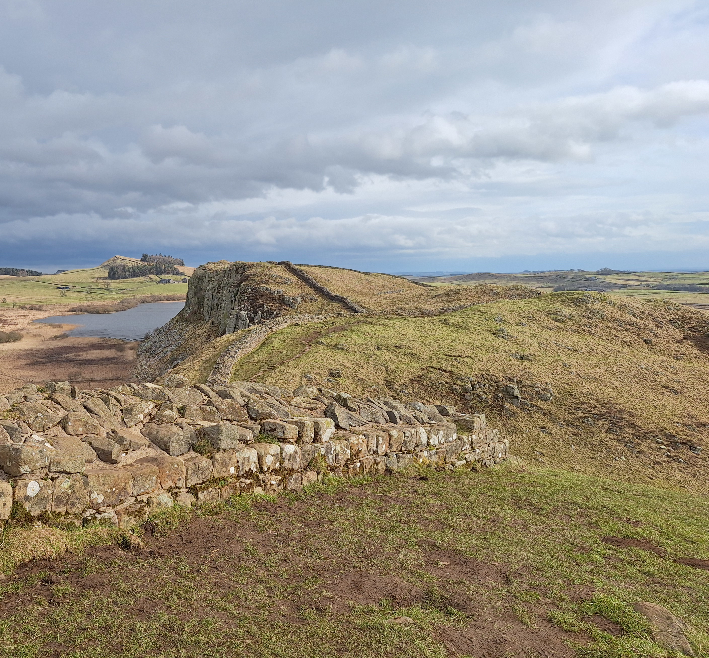

# Social event

On Saturday, 7 June, we will organise a half-day/one day trip to Hadrian's Wall:

We will offer two variants of this trip: A short one (approx 5.5km) and a longer one (approx 17km).
The shortest variant is will provide the opportunity to have a drop-off at Newcastle Airport.
Hadrian's Wall is free of charge to walk. 
Participants might want to visit <a href="https://www.english-heritage.org.uk/visit/places/housesteads-roman-fort-hadrians-wall/">Housesteads Roman Fort</a> or have meals in one of the pubs along the way on their own expenses.

## Agenda

The agenda is yet to be confirmed by the bus company.

- 8:00 Departure from Department of Computer Science; participants can leave their luggage in the bus
- 8:10 Pick up at car park of Hotel Indigo
- 8:20 Pick up at car park of Radisson Blu
- 10:00 Arrival at Housestead's Romand Fort
- 12:30 Option A: Pick up at The Sill National Landscape Discovery centre (next to Once Brewed Pub) and drop off at Newcastle Airport around 13:30 (there is also a metro connection to Newcastle Central Station). Alternatively, people can 
- 16:00 Option B: Pick up at the Greenhead Hotel, Bar & Restaurant and drop off at eiter Durham Station or Computer Science building (est 17:00)

We will collect preferred variants of participants upon departure, but it is the participants' own responsibility to arrive at the pick up points on time.

## Insurance and risk

Hiking is a risky activity. 
Participants join the trip on their own risk, i.e. the organiser is not liable.
We will collect emergency contact information and any medical information to pass on to paramedics upon departure.
Good footwear and waterproofs, as well as sufficient water and snacks are recommended.

## Further participants

We might have the opportunity to fill empty spaces on the bus with spouses and friends. Please contact the organisers ahead of time.

